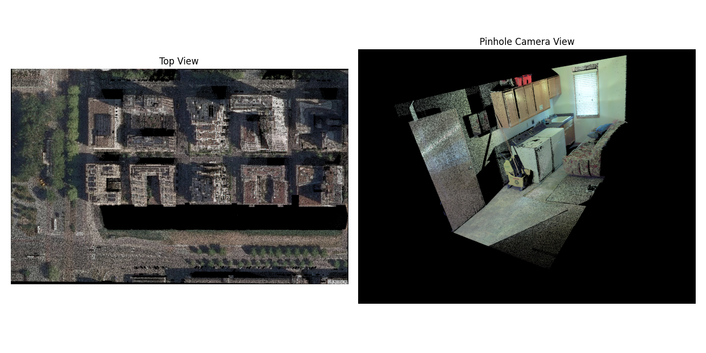
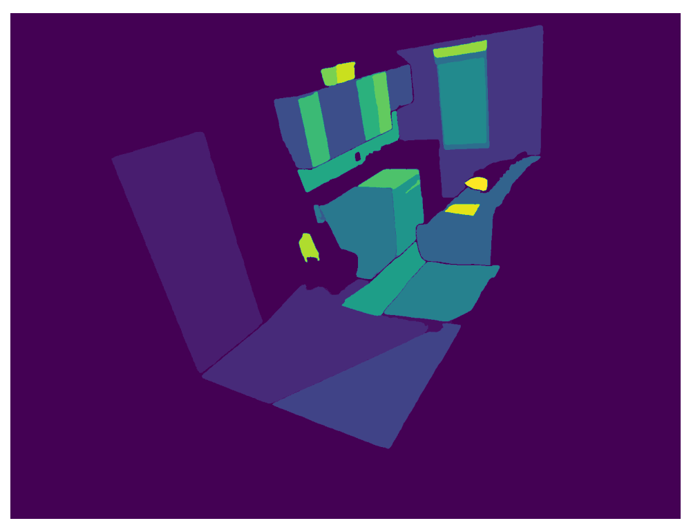
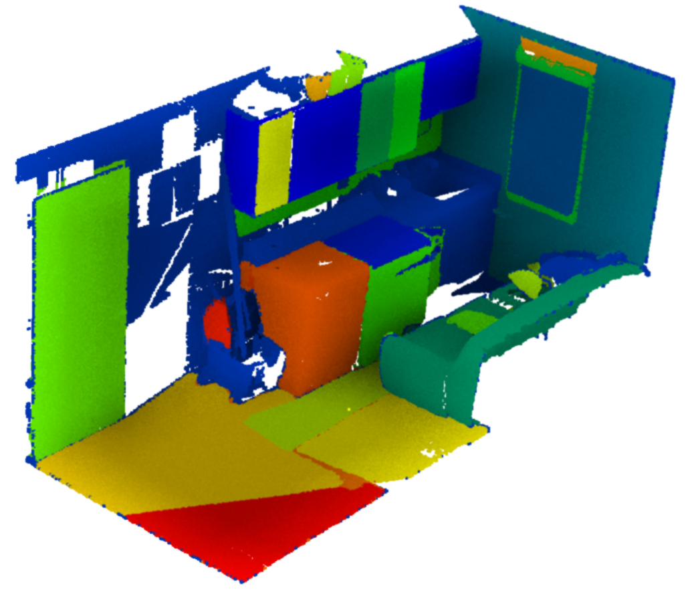

# Summary

`Segment-Lidar` is a Python package for automatic unsupervised segmentation of aerial LiDAR data. It proposes an image-based approach for segmenting aerial point clouds using `Segment-Anthing Model (SAM)` package from [Meta AI](https://github.com/facebookresearch).

The API provides functions and classes to define the segmentation model and its parameters, and also to handle transformation between 3D point clouds and images. The package also relies on other dependencies that make use of `SAM`. This includes the `Segment-Geospatial` package from [Open Geospatial Solutions](https://github.com/opengeos) for segmenting geospatial data and the `Grounded-SAM` package from [The International Digital Economy Academy Research (IDEA-Research)](https://github.com/IDEA-Research) that combines `SAM` with `Grounding DINO` to detect and segment anything with text prompts.

For optimization purposes, `Segment-Lidar` enables using `Fast Segment Anything Model (FastSAM)` as an alternative to `SAM` original API. The `FastSAM` is a Convolutional Neural Network (CNN) `SAM` that was trained using only 2% of the `SA-1B` dataset published by `SAM` authors. It achieves comparable performance at 50x higher run-time speed.

# Statement of need

The swift advancement of data acquisition technologies like LiDAR sensors and depth cameras has led to the widespread use of 3D point cloud data, which, in turn, has started a growing interest among researchers in the field of 3D scene comprehension. However, the comprehension of such unstructured, disordered and spare point clouds yields technical challenges [@su:2022].

One approach for point cloud learning is to use deep neural networks. Deep learning has been successfully used to solve various 2D vision problems. In fact, due to the effective use of deep learning models in computer vision applications, many works focused on developing image segmentation approaches using deep learning models [@shevrin:2020]. Recently, deep learning applied to point clouds has become also very popular, and many methods have been suggested to solve various problems in this field [@yulan:2020]. Some of these methods process the point cloud as a structured image to leverage the performance of 2D deep learning models. These models are also known for the fewer computational and data resources required for finetuning in order to obtain competitive performance on downstream tasks [@chenfeng:2021].

The Segment Anything Model (SAM) is one of the most popular image segmentation models that was released recently. The model was introduced by @kirillov:2023 as a part of the Segment Anything (SA) project and has three components: an image encoder, a flexible prompt encoder and a fast mask decoder. It was trained on SA-1B dataset that consists of 11 millions licensed and privacy respecting images and 1.1 billion high-quality segmentation masks.

Due to its zero-shot performance, SAM served as the foundation for the development of many other packages. `Segment-Geospatial` is one of these packages that was designed to segment geospatial data using Segment Anything Model [@wu:2023]. `Grounded-SAM` is another package that combines `Grounding DINO` [@liu:2023] with `Segment Anythin Model` to automatically detect and segment images using text prompts.

Other implementations focused on reducing the computation costs of SAM that prevent it from wider industry applications. @zhao:2023 introduced `Fast Segment Anything` as a speed-up alternative method for the fundamental task of SAM with comparable performance at 50 times higher run-time speed.

Regarding our work, we propose `Segment-Lidar` as an open-source Python package for automatic unsupervised 3D LiDAR-segmentation using Segment Anything Model (SAM) and other dependencies that make use of it.

# Overview of the method

The idea behind using `SAM` is to automatically identify and separate different instances in 3D LiDAR data through automated image segmentation. The process can be divided into four main steps:

## Step 1: Ground filtering using Cloth Simulation Filter [Optional]

The ground filtering is optional but preferred for aerial LiDAR data with top viewpoint. It serves two primary purposes that significantly enhance the accuracy and reliability of object detection and segmentation. First, ground filtering helps improve the detection of objects within the image by eliminating the interference of ground points. This is especially vital for identifying objects such as buildings, vehicles, and infrastructure, as it allows for a clearer focus on target objects against a clutter-free background. Second, ground filtering prevents the projection of segmentation results onto ground points, especially for tall structures like trees and poles.

Our package uses the Cloth Simulation Filter (CSF) to separate the ground points from non-ground points. The algorithm was proposed by @zhang:2016 as an implementation of the Cloth Simulation algorithm used in 3D computer graphics to simulate fabric attached to an object.

## Step 2: Projection of the 3D point cloud into a two-dimensional image

This projection is based on two possible view: top view and pinhole camera view.

1. **Top Projection**:

In a top view projection, the 3D coordinates (X, Y, Z) are projected onto the 2D coordinates (u, v) on the image plane (\autoref{fig:views}).

The projection of each point is given by:

$$u = \frac{x - x_{min}}{d}$$
$$v = \frac{y_{max} - y}{d}$$
$$P_{uv} = \begin{bmatrix}
r \\
g \\
b
\end{bmatrix}
$$

`u` represents the horizontal axis in the image.

`v` represents the vertical axis in the image.

`x, y and z` are the point coordinates.

`r, g and b` are the RGB colors of the point.

`d` represents the pixel resolution.

2. **Pinhole Camera View**:

This transformation is modeled by a pinhole camera, which mimics the perspective effects of capturing scenes through a small aperture. The camera maps points from a three-dimensional space to a two-dimensional image plane by combining intrinsic and extrinsic parameters.

The camera has intrinsic parameters that define its internal properties. As shown in \autoref{fig:intrinsic}, these parameters include the focal length $f$ and the principal point $(u_{0}, v_{0})$ that are combined in a $3\times3$ camera matrix $K$:

$$
K = \begin{bmatrix}
  f_{x} & 0 & u_{0} \\
  0 & f_{y} & v_{0} \\
  0 & 0 & 1
\end{bmatrix}
$$

![Camera intrinsic parameters [@david:2019].\label{fig:intrinsic}](figures/intrinsic.jpg)

In addition to the internal parameters, the position and orientation of the camera in 3D space are described by extrinsic parameters. These include the $3\times3$ rotation matrix $R$ and the $3\times1$ translation vector $T$ (\autoref{fig:extrinsic}). Therefore, the camera projection matrix is defined as follow:

$$P = K[R|T]$$

![Pinhole camera model [@jerome:2022].\label{fig:extrinsic}](figures/extrinsic.jpg)

The projection matrix $P$ is then used to calculate the pixel coordinates $(u, v)$ of a 3D point coordinates by: first, converting the world-coordinates $(x_{w}, y_{w}, z_{w})$ of the point to the camera-coordinate system $(x_{c}, y_{c}, z_{c})$, then the camera-coordinates to image-coordinates $(u, v)$.

$$ X_{W} = R \cdot (X_{C} - C_{0})$$

$C_{0}$ is the camera center coordinates in the world-coordinate system: $C_{0} = -R^T \cdot T$

$$ x = P \cdot X_{C}$$

where $x = [u, v, w]$

$(u, w)$ are normalized by the third coordinates $w$ and then used to calculate the image-coordinates as follow:

$$u = \frac{u}{w} - u_{0}$$

$$v = \frac{v}{w} - v_{0}$$

## Step 3: Inference on the generated image

The Segment-Anything Model (SAM) was used to generate masks for all objects in the resulting image [@kirillov:2023]. Additionally, Segment-Geospatial [@wu:2023] is implemented to leverage SAM for geospatial analysis by enabling users to achieve results with minimal parameters tuning. The results for sample data, for both top view and pinhole camera view, are illustrated in \autoref{fig:top_inference} and \autoref{fig:pinhole_inference} respectively.

{ width=65% }

## Step 4: Reprojection of results on the 3D point cloud

In the final step of our methodology, we seamlessly reproject the instance segmentation results onto the original point cloud (\autoref{fig:top_results} and \autoref{fig:pinhole_results}). This associates each point in the cloud with its corresponding segment label obtained from the 2D image segmentation. Mathematically, this process involves identifying the 2D image coordinates for each point in the point cloud, which can be achieved through reverse projection of the cubic or panoramic projection. Once the corresponding 2D image coordinates are identified, we assign the segment label from the segmentation map to the corresponding point in the cloud.

{ width=70% }

# Use of the package

The package is available as a Python library and can be installed directly from [PyPI](https://pypi.org/project/segment-lidar/). We recommend using `Python>=3.9`. It is also required to install [PyTorch](https://pytorch.org/) before installing `segment-lidar`.

The usage of `Segment-Lidar` is comprehensively detailed in the accompanying documentation, which includes tutorials providing step-by-step instructions.

The package also offers an API comprising classes and functions to ensure interoperability with other libraries for numerical computing, image processing and machine learning.

# References